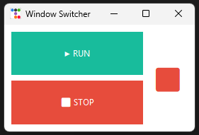

# Window Switcher

Aplicación para cambiar automáticamente entre ventanas en Windows.



## 🏗️ Arquitectura

Este proyecto sigue principios de **Arquitectura Limpia** (Clean Architecture) y **SOLID**:

```
Switch_Windows/
├── config/              # Configuración centralizada
│   ├── __init__.py
│   └── settings.py      # Todos los parámetros configurables
│
├── controllers/         # Capa de adaptadores (OS-specific)
│   ├── __init__.py
│   ├── base_controller.py       # Interfaz abstracta
│   ├── windows_controller.py    # Implementación para Windows
│   └── linux_controller.py      # (Futuro) Implementación para Linux
│
├── core/                # Lógica de negocio
│   ├── __init__.py
│   └── switcher_service.py      # Servicio principal
│
├── ui/                  # Interfaz de usuario
│   ├── __init__.py
│   └── gui.py           # GUI con Tkinter
│
├── utils/               # Utilidades generales
│   ├── __init__.py
│   └── os_detect.py     # Detección de sistema operativo
│
├── main.py              # Punto de entrada
└── requirements.txt     # Dependencias
```

## 📋 Principios Aplicados

### 1. **Separación de Responsabilidades (SRP)**
- Cada módulo tiene una única responsabilidad
- `gui.py`: Solo presentación
- `switcher_service.py`: Solo lógica de negocio
- `windows_controller.py`: Solo interacción con Windows API

### 2. **Inversión de Dependencias (DIP)**
- `BaseWindowController` define una interfaz abstracta
- El servicio depende de la abstracción, no de implementaciones concretas
- Fácil agregar soporte para otros sistemas operativos

### 3. **Abierto/Cerrado (OCP)**
- Extensible para nuevas funcionalidades sin modificar código existente
- Agregar un nuevo OS solo requiere implementar `BaseWindowController`

### 4. **Configuración Centralizada**
- Todos los parámetros en `config/settings.py`
- Fácil modificar sin tocar código

### 5. **Patrón MVC**
- **Model**: `WindowSwitcherService`
- **View**: `WindowSwitcherGUI`
- **Controller**: `Application` (orquestador)

## 🚀 Instalación

### Para Usuarios (Solo ejecutar)
Si solo quieres usar la aplicación, descarga el archivo `.exe` de la sección de releases.

### Para Desarrolladores (Experimentar con el código)

1. **Clonar el repositorio**
   ```bash
   git clone <url-del-repositorio>
   cd Switch_Windows
   ```

2. **Crear entorno virtual** (Recomendado)
   ```bash
   python -m venv venv
   venv\Scripts\activate
   ```

3. **Instalar dependencias**
   ```bash
   pip install -r requirements.txt
   ```

4. **(Opcional) Instalar herramientas de desarrollo**
   ```bash
   pip install -r requirements-dev.txt
   ```

5. **Verificar instalación**
   ```bash
   python main.py
   ```

## ⚙️ Configuración

Edita `config/settings.py` para personalizar:

```python
# Ventanas objetivo actuales
TARGETS = [
    "Google Chrome",
    "Visual Studio Code"
]

# Intervalo de cambio (ms)
INTERVAL_MS = 60000  # 60 segundos
```

## ▶️ Uso

```bash
python main.py
```

1. Presiona **RUN** para iniciar el cambio automático
2. Presiona **STOP** para detenerlo

## 🔮 Futuras Mejoras

- [ ] Selector de ventanas en la UI
- [ ] Configuración de intervalo desde la UI
- [ ] Soporte para Linux y macOS
- [ ] Guardar configuración en archivo

## 📝 Licencia

MIT
